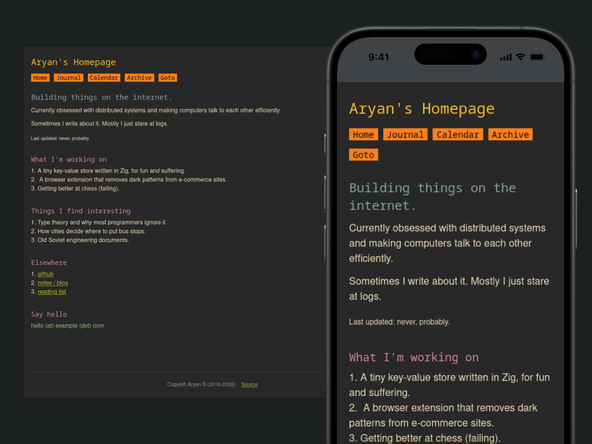
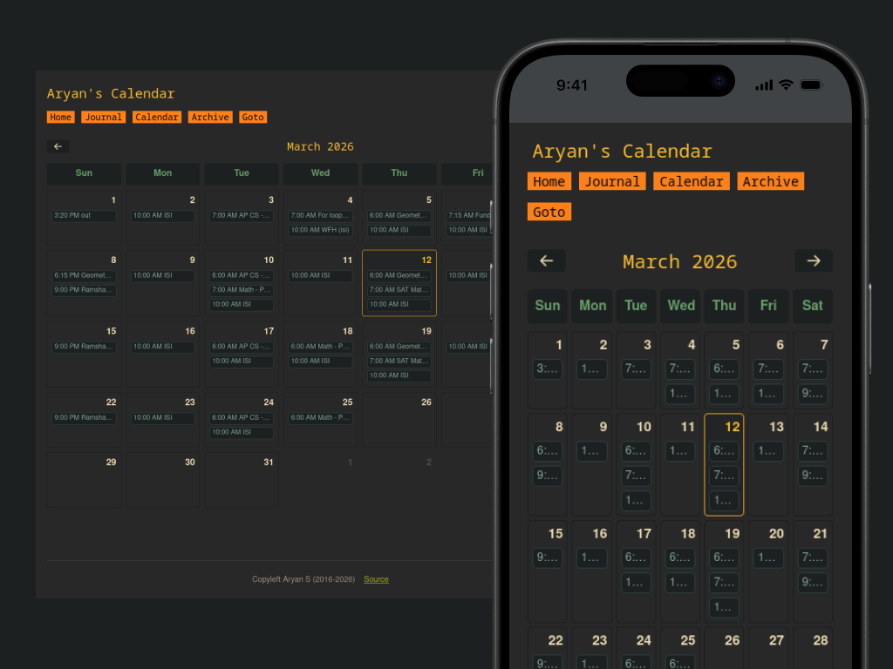
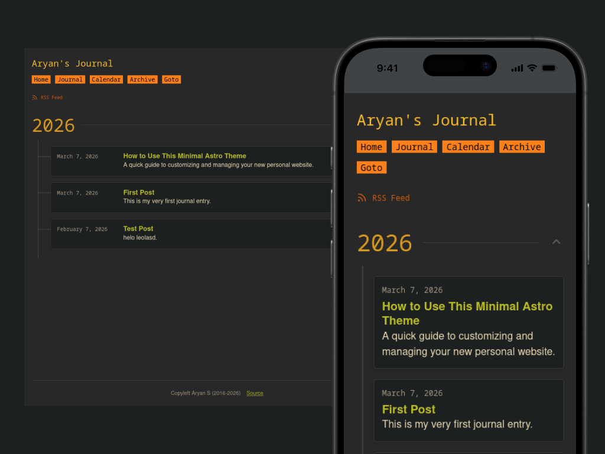
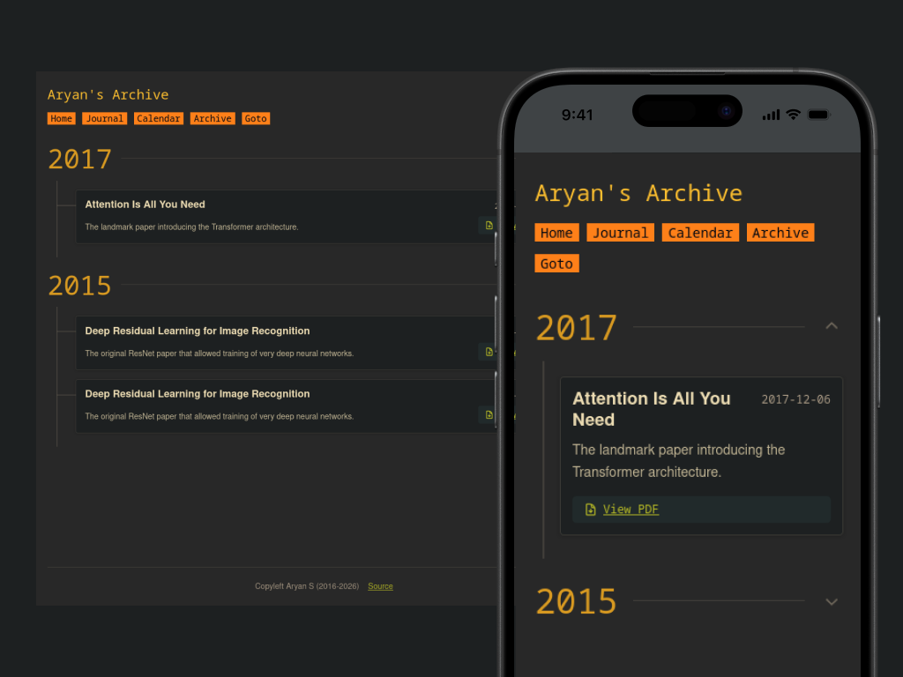

# Man-page Website Theme

A website theme I made in astro goal of this website is to look marginaly better than man page

I have had instructions laid out here for anyone wanting to use this, if something doesn't work contact me.

`singh@a115.xyz`

[](https://astro.build/)
[](https://docs.astro.build/en/guides/rss/)
[](https://docs.astro.build/en/guides/integrations-guide/sitemap/)
[](https://tailwindcss.com/)
[](https://tailwindcss.com/docs/installation/using-vite)
[](https://date-fns.org/)
[](https://typicode.github.io/husky/)
[](https://github.com/lint-staged/lint-staged)
[](https://prettier.io/)
[](https://github.com/withastro/prettier-plugin-astro)

## Preview Images






## People using it

1. [demo website](https://man.a115.xyz)
2. [my website](https://man.a115.xyz)

If you use it in any capacity please let me and I will add your site here, sad that no one uses it other than me

`singh@a115.xyz`

## Features

- **Dynamic Google Calendar:** A fully responsive, grid-based calendar page (`/calendar`) that fetches live events from Google Calendar API v3.
- **Modular Calendar Code:** Calendar code is split into typed data utilities, UI components, and a client controller so the page file is small and maintainable.
- **Journal/Blog System:** Markdown-based blogging out of the box using Astro Collections (`/journal`).
- **Archive Page:** Easily list academic papers, PDFs, or external links grouped by year via a simple JSON mapping (`/archive`).
- **RSS Feed:** Auto-generated RSS feed for your journal entries.

## Setup & Usage

### 1. Installation

Clone the repository and install dependencies:

```bash
npm i
```

### 2. Configure Environment Variables

To make the `/calendar` page work, you need a Google Calendar API key.
Copy the `.env.example` file to `.env`:

```bash
cp .env.example .env
```

Open `.env` and configure your keys.

**How to get a Google API Key:**

1. Go to the [Google Cloud Console](https://console.cloud.google.com/).
2. Create a new project or select an existing one.
3. Search for "Google Calendar API" and click **Enable**.
4. Go to **APIs & Services > Credentials** on the left sidebar.
5. Click **Create Credentials > API Key**.
6. Paste this key into `GOOGLE_API_KEY` in your `.env` file.

**How to get your Calendar ID:**

1. Go to [Google Calendar](https://calendar.google.com/) on your computer.
2. Under "My calendars" on the left, hover over the calendar you want to share, click the three vertical dots (Options), and click **Settings and sharing**.
3. Under the "Access permissions for events" section, ensure **Make available to public** is checked.
4. Scroll down to the "Integrate calendar" section. You will see your **Calendar ID** (it often looks like `your_email@gmail.com` or a long string ending in `@group.calendar.google.com`).
5. Paste this ID into `GOOGLE_CALENDAR_ID` in your `.env` file.

Grid event chips are intentionally non-clickable. To open a Google Calendar link, click a day to open the modal, then click **View in Calendar**.

### 3. Customizing Your Info

- Open `consts.ts` in the root directory and update the `name`, `lastname`, and overall website metadata.
- Open `src/content/navbar.json` to change the links in your top navigation bar.

### 4. Writing Blog Posts

Navigate to `src/content/journal/`. Create a new `.md` file with the following frontmatter:

```markdown
---
title: "My New Post"
date: 2026-03-07
description: "A short description goes here."
---

Write your markdown content here...
```

The post will automatically appear on the `/journal` page and be added to the RSS feed.

### 5. Managing the Archive

To add PDFs or links to the `/archive` page:

1. Put any PDF files in `public/pdfs/`.
2. Open `src/content/archive.json`.
3. Add a new object to the array:

```json
{
  "title": "Document Title",
  "url": "/pdfs/filename.pdf",
  "description": "A short summary of the document.",
  "date": "2026-01-01"
}
```

The Archive page will automatically parse the dates and group them by year.

---

Regards,<br/>
Aryan S.
